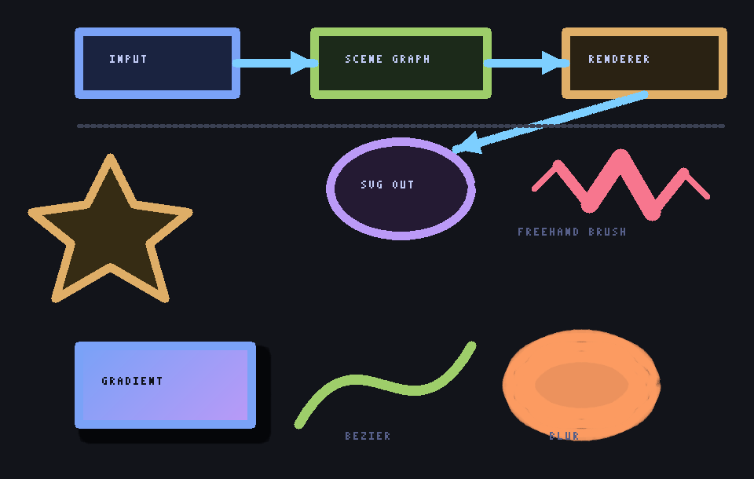

# Canvux

**A terminal-native infinite vector canvas.** Draw with mouse and keyboard, edit vector objects, organize layers, and export standards-compliant SVG or PNG — all from a single static Go binary.



*The diagram above was drawn in Canvux and exported with `canvux export`.*

## Highlights

- **Infinite canvas** — pan and zoom (0.05x–400x) over unbounded world coordinates
- **Full mouse support** — draw, drag-move, marquee-select, corner-handle resize, wheel zoom at cursor, clickable toolbar
- **11 tools** — select, pan, brush, line, rect, ellipse, arrow, polygon, bézier curve, text, eraser
- **Advanced styling** — linear gradients, drop shadows, blur, dashed strokes, opacity, rotation, and a speed-sensitive variable-width brush
- **Bézier curves** — drag to place, then bend them by dragging their round control handles
- **Smart alignment guides** — shapes snap to other objects' edges and centers as you draw or move them, with guide lines (hold shift to disable)
- **Multi-line text** — a full caret (←→↑↓, Home/End), `ctrl+j` for newlines, editable in place
- **Smooth freehand** — brush strokes are simplified and smoothed on release, so they're clean and compact
- **Mouse-free drawing** — `K` toggles keyboard-draw: move a virtual cursor with the arrows, set points with Enter
- **Diagram library** — `i` inserts flowchart, UML, ER, architecture, sticky-note, table, and mind-map stencils
- **Realtime collaboration** — `canvux serve` hosts a document; others `canvux join` and edit together with live peer cursors
- **Plugins** — any executable named `canvux-*` extends the editor via JSON over stdin/stdout; write generators, importers, exporters, and transforms in any language
- **Presentation mode** — `P` turns layers into slides; plus a light "whiteboard" theme
- **Image embedding** — import a PNG/JPEG/GIF as a run-merged grid of vector rects
- **Two render modes** — colorful half-block cells, or hi-res braille (2×4 dots per cell), toggle with `M`
- **Works on any terminal** — truecolor by default, auto-degrades to 256/16-color or monochrome (respects `NO_COLOR`; override with `--color`)
- **Precise drawing cues** — a local cursor crosshair, live `W×H` / length∠angle readouts while dragging, and animated marching-ants selection that stays visible on any color
- **Real editor features** — undo/redo (200 levels), copy/paste, duplicate, rotate, z-order, snap-to-grid, shift-constrained drawing, multi-select, layers with lock/hide
- **Command palette** — `:` fuzzy-searches every command (including plugin commands)
- **Configurable & rebindable** — `~/.config/canvux/config.json` (project `./.canvux.json` overrides) sets theme, palette, render mode, grid/snap, autosave, and remaps any key to any action
- **Accessible** — colorblind-safe (Okabe–Ito) and high-contrast palettes/themes, plus an Outline navigator (`: outline`) that lists objects as text for keyboard-first, screen-reader-friendly editing
- **Git-friendly files** — `.canvux` is indented JSON with a versioned schema; autosaves with crash recovery on reopen; `canvux diff` gives object-level diffs
- **System clipboard** — `ctrl+shift+c` copies the selection as an SVG snippet (native clipboard locally, OSC 52 over SSH) to paste into other tools
- **SVG round-trip** — export clean SVG (gradients, filters, bézier paths), import SVG shapes and paths back
- **PNG export** — rasterized at any scale from the same renderer
- **Scriptable CLI** — `render`, `export`, `add`, `diff`, `serve`, `join`, `plugins`, `info` for pipelines
- **Fast** — a frame with 10 000 objects rasterizes in ~5 ms; single ~4.5 MB binary, no runtime deps

## Install

```sh
go install github.com/anishhs-gh/canvux/cmd/canvux@latest
# or from a checkout:
make build      # -> ./canvux
```

## Use

```sh
canvux                       # blank canvas
canvux drawing.canvux        # open (or create on save) a project
canvux render examples/demo.canvux          # print a drawing to stdout
canvux export drawing.canvux --svg out.svg --png out.png --scale 10
canvux add rect drawing.canvux --at 0,0 --size 20,10 --fill '#334'
canvux diff old.canvux new.canvux           # object-level diff (exit 1 if differ)
canvux info drawing.canvux   # stats

# collaborate
canvux serve team.canvux                    # host on :7878
canvux join 192.168.1.5:7878 --name alice   # join from another machine
```

### The 90-second tour

| | |
|---|---|
| `r` then drag | draw a rectangle (`shift` = square) |
| `f` | toggle fill · `c` / `C` pick stroke / fill color |
| `v` | select — drag to move, corner handles resize, `del` deletes |
| `t`, click, type | place text (double-click text to edit) |
| `p`, click points, `enter` | polygon |
| `n` then drag | bézier curve — reselect and drag its round handles to bend |
| `i` | insert a diagram stencil (search "class", "cloud", "sticky"…) |
| `S` / `B` | drop shadow / blur on selection |
| `C`, pick color, `g` | gradient fill (second color) |
| `P` | presentation mode (layers become slides) |
| wheel / right-drag | zoom at cursor / pan |
| `u` / `U` | undo / redo |
| `:` | command palette · `?` full help · `L` layers |
| `ctrl+s` / `ctrl+e` | save / export |

Everything else is in the in-app help (`?`).

## File format

`.canvux` files are indented JSON: `version`, `camera`, `layers`, `objects`, `metadata`. Forward-incompatible files are rejected by version check; missing style fields get sane defaults, so the format can grow. See [`examples/demo.canvux`](examples/demo.canvux).

## Configuration

Canvux reads `~/.config/canvux/config.json`, then `./.canvux.json` in the current directory (project settings override global). Every field is optional. See [`examples/config.example.json`](examples/config.example.json):

```json
{
  "theme": "high-contrast",      // dark | light | high-contrast
  "palette": "colorblind",       // default | colorblind | high-contrast
  "renderMode": "braille",       // block | braille
  "color": "auto",               // auto | truecolor | 256 | 16 | off
  "grid": true,
  "snap": false,
  "autosaveSeconds": 30,
  "keys": { "ctrl+d": "edit.duplicate", "T": "view.cycle-theme" }
}
```

Any key can be remapped to any action ID (the palette shows each command's current key; action IDs are the stable `tool.rect`, `edit.undo`, … names). Theme and palette can also be cycled live from the command palette.

## Architecture

```
cmd/canvux        CLI: editor, render, export, add, diff, serve, join, plugins, info
internal/app      bubbletea model: tools, input, overlays, toolbar/status UI,
                  actions/keymap, alignment guides, keyboard-draw,
                  presentation, plugin + collaboration integration
internal/config   layered JSON config (global + project-local)
internal/scene    scene graph: objects, layers, hit-testing, (de)serialization
internal/render   rasterizer (Surface interface) + cell compositors (half-block/braille) + ANSI + color profiles
internal/svg      SVG export + import (gradients, filters, path flattening)
internal/export   PNG export (image-backed Surface, micro bitmap font)
internal/imgembed image → run-merged vector rects
internal/plugin   external-process plugin protocol (JSON over stdio)
internal/collab   realtime collaboration server + client (TCP, JSON lines)
internal/clipboard system clipboard (native tools + OSC 52 fallback)
internal/history  snapshot undo/redo
internal/geom     vectors, rects, transforms
```

The rasterizer draws into an abstract `Surface`, so the terminal buffer and the PNG exporter share the same drawing code. Plugins and collaboration are separable packages the editor drives through small integration files.

See [`examples/plugins/`](examples/plugins/) for the plugin protocol and a working example.

## Development

```sh
make test        # unit tests (JSON/SVG round-trip, hit testing, rendering, culling)
make bench       # 10k-object frame benchmark
```

## Roadmap status

**All roadmap phases (0–14) are implemented.** Foundation, camera, rendering, scene graph, editing, drawing tools, project files, SVG round-trip, productivity, advanced drawing (bézier, gradients, shadow, blur, variable-width strokes), the diagramming stencil library, the plugin API, CLI scripting (`add`/`render`/`export`/`diff`), realtime collaboration with live cursors, and ecosystem features — presentation mode, whiteboard theme, git-diff viewer, and image embedding.

Ecosystem items that need external spec tables or services (QR/barcode encoders, Mermaid/LaTeX rendering, AI object generation) are intentionally left to the plugin API rather than bundled — a plugin can add any of them without touching the core.

## License

MIT
